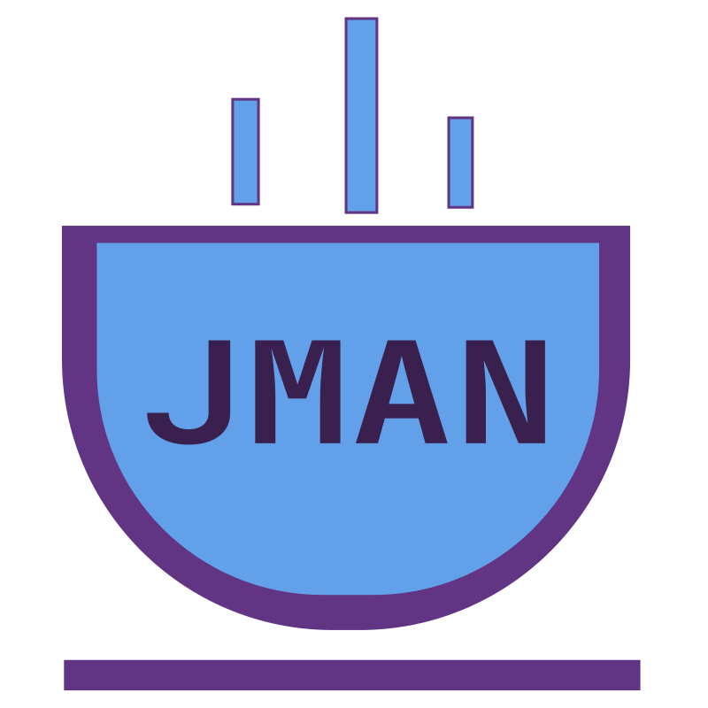

<p align="center">
  
</p>

# JMAN

[](https://github.com/zonnedev/jman/actions/workflows/ci.yml)
[](https://github.com/zonnedev/jman/releases)

JMAN (`jman`) is a native Rust build tool and Java language server for deterministic,
locked Java workspaces. It resolves Maven repositories itself; normal build,
test, run, and editor operations do not invoke Maven or Gradle.

The public name and executable are **JMAN** and `jman`. Its project format,
cache, environment, and editor namespaces consistently use `jman.toml`,
`jman.lock`, `.jman/`, `JMAN_*`, and `jman.java.*`.

## Quick start

```bash
jman init hello
cd hello
jman check
jman test
jman run
```

Import an existing Maven project with `jman init --import .`. Use `jman sync`
after dependency changes, `jman build --all` for all reproducible archives, and
`jman doctor` to inspect the selected JDK and optional container runtime.

Manage Java toolchains directly through JMAN:

```bash
jman java list                   # installed first, then remotely available JDKs
jman java list --local           # installed JDKs only; no network access
jman java list --major 21        # filter one Java feature release
jman java list --lts             # show only LTS release lines
jman java list --vendor corretto # filter one distribution
jman java list --refresh         # revalidate the cached remote catalog
jman java list --format json     # stable structured output for integrations
jman java install 21             # install Temurin (the default distribution)
jman java install 21 --vendor zulu
jman java use 21 --vendor zulu   # pin the project to a distribution and version
```

The platform-specific multi-distribution catalog is discovered through the
Foojay Disco API and translated into JMAN's provider-neutral model. It is cached under
`$JMAN_CACHE_DIR/catalog/` (normally `~/.cache/jman/catalog/`) for 15 minutes.
Expired entries are revalidated with HTTP ETags or `Last-Modified`. If Foojay is temporarily
unreachable, JMAN reports the problem and falls back to the last valid cached
catalog. `--refresh` bypasses the freshness window while retaining conditional
requests; `--local` never contacts the network. Installation resolves the
vendor archive and SHA-256 digest through the provider, then requires HTTPS and
checks every download and redirect host against a distribution-scoped allowlist
before accepting checksum-verified bytes. Temurin remains the default.

The precise supported metadata boundary and release gates are defined in
[the product contract](docs/product-contract.md). Changes are recorded in the
[changelog](CHANGELOG.md).

## Development

Use `make gates` for the complete local acceptance suite, `cargo test
--workspace` for Rust tests, and `make test-java` for the repository's Java
components. `make ci` runs the portable suite used by GitHub Actions. `cargo
run -p jman-cli -- --help` shows the command surface. Release automation and
maintainer setup are documented in [the release guide](docs/releasing.md).

## Supported Maven metadata

The native resolver supports parent inheritance, properties, dependency
management and imported BOMs, compile/runtime/provided/test scopes, optional
dependencies, exclusions, classifiers and types, repositories, snapshots,
relocation, and Maven nearest-wins mediation. Reactor imports preserve modules,
local parents, and inter-module dependencies. Maven build plugins are detected
and reported but are deliberately not executed or translated; compiler options,
processors, and main classes belong in `jman.toml`.

Compatibility is validated by the fixtures and differential harness described
in [docs/compatibility-matrix.md](docs/compatibility-matrix.md). The current MVP
does not claim full Maven 3/4 model compatibility, arbitrary plugin behavior, or
100% agreement with every public Maven project.

## Test contract

`jman test` compiles `src/test/java` and `src/integrationTest/java`, then runs each
selected module in a separate JVM. `--source-set unit` or `--source-set
integration` selects one source set; the default `all` runs both. Module JVMs
are bounded by `--jobs`, while reporting is sorted by module for reproducible
output.

The cached `jman-runner.jar` is compiled from the repository-owned Java source
with the selected project JDK. Rust and runner use protocol version 2. `--report
json` emits newline-delimited `test-module-started`, `test-case`, and
`test-module-finished` events. Test cases retain a stable selector plus a unique
display/invocation identity, exact failure message/details, duration, and retry
attempt. Reruns use exact class or `Class#method` selectors. The protocol exposes
debug descriptors and an explicit unsupported coverage response instead of
silently pretending coverage was collected.

Tests receive `-Djman.test.port=0` by default. Applications that need an HTTP port
must read `jman.test.port` and bind port zero so the operating system chooses an
ephemeral port. Set `JMAN_TEST_PORT` to opt into a fixed value; JMAN does not
reserve a port and does not claim collision-free handoff.

Docker, Podman, `DOCKER_HOST`, `CONTAINER_HOST`, and Testcontainers environment
configuration are inherited unchanged. `jman doctor` probes Docker and Podman and
reports the explicit endpoint when configured. Ctrl-C cancels the orchestration
future and runner JVMs use kill-on-drop for best-effort process cleanup.
Testcontainers' resource reaper remains responsible for containers. SIGKILL,
host crashes, and disabled reapers can still leave resources behind.

## MVP limitations

- Coverage collection is not bundled.
- Cancellation is best effort across operating-system process boundaries.
- Generated source metadata is read-only guidance; clients enforce editing UX.
- Workspace file notifications trigger a safe reindex and never perform an
  implicit destructive filesystem mutation.
- External Maven/Gradle editor providers require project-local wrappers or the
  corresponding executable and remain separate from the native JMAN build path.
