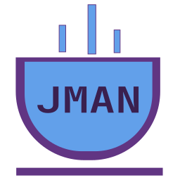

<p align="center">
  
</p>

# JMAN Java

Development extension for the Rust/GraalVM Java language server.

The packaged extension contains the `jman` executable and
`libjman_javac_frontend.so`; it starts the embedded server as `jman lsp`.
Configure `jman.java.javaHome` to the Java 25 GraalVM installation used to build
the native library. Leave `jman.java.buildSystem` on `auto` to prefer JMAN when
`jman.toml` exists, or explicitly choose `jman`, `gradle`, or `maven`.

Language-server logs are available in the **JMAN Java** output channel.

## Development

From the repository root:

```bash
make package-vscode
code --install-extension target/vscode/jman-java-0.1.6.vsix
```

Then configure:

```json
{
  "jman.java.javaHome": "/home/you/.sdkman/candidates/java/25.0.4-graal",
  "jman.java.buildSystem": "auto"
}
```

Open a JMAN, Maven, or Gradle project and then a Java file. For an isolated first
test, disable other Java language-server extensions in that workspace.

If startup fails, inspect **View → Output → JMAN Java**. Confirm that
the configured GraalVM exists, the project wrapper is executable, and Maven or
Gradle can resolve the project from a terminal.
